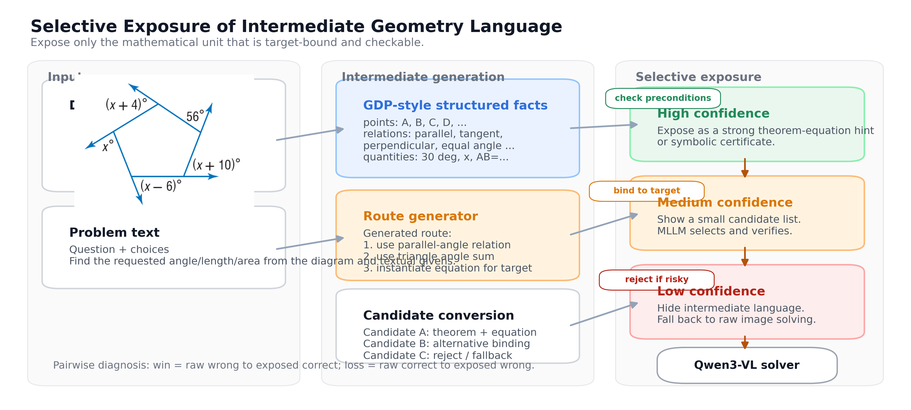
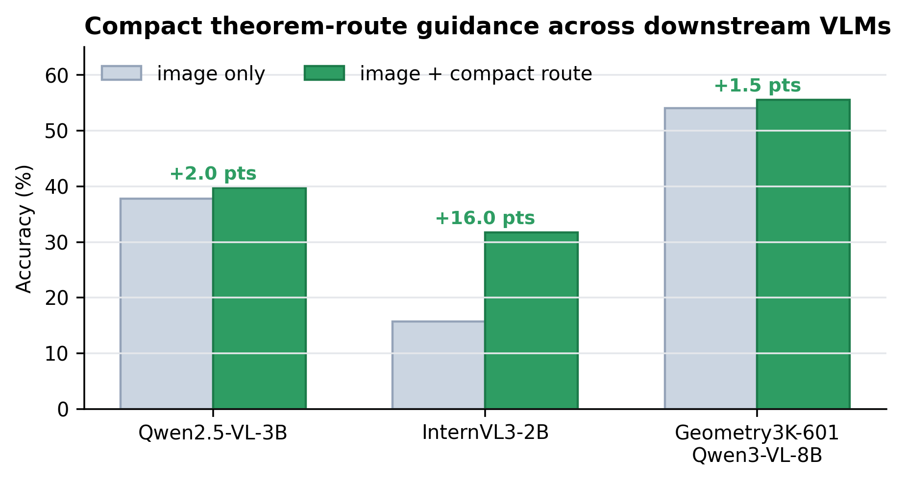

# Selective Route Exposure

Code, paper draft, adapters, and experiment snapshots for **Selective Exposure of Intermediate Geometry Language**.

> Geometry intermediate language is not useful just because it is structured. In our experiments, the useful unit is a compact theorem-level action, and it should be exposed to the downstream MLLM only when a trust policy judges it likely to help.

[中文 README](README_zh.md) · [English paper PDF](paper_arxiv_demo/main.pdf) · [Chinese paper PDF](paper_arxiv_demo/main_zh.pdf) · [Reproduction notes](docs/TARGET_BINDING_VERIFIER_REPRO.md)



## What This Repository Contains

This repository is a cleaned research artifact package rather than a full raw-data mirror.

- `paper_arxiv_demo/`: latest English/Chinese LaTeX paper draft, compiled PDFs, figures, tables, and result snapshots.
- `tools/`: data construction, GDP parsing, theorem-route generation, downstream MLLM evaluation, and route-verifier scripts.
- `target_binding_verifier/`: second-stage balanced target-binding verifier scripts.
- `results/`: JSON/JSONL/log summaries for Geometry3K, GeoQA, PGPS9K, route/candidate, trust-policy, and verifier experiments.
- `models/`: LoRA adapters for `Qwen/Qwen3-1.7B` route/plan generation.
- `data_artifacts/`: zipped derived data artifacts used by the experiments.
- `docs/`: remote reproduction notes and a short research-experience summary.

Large third-party raw archives are intentionally not committed. See [MANIFEST.md](MANIFEST.md).

## Core Claim

The paper studies three increasingly action-oriented intermediate representations:

| Unit | Role | Main Finding |
|---|---|---|
| Descriptive facts | Parsed geometry facts from GDP-style language or oracle predicates | Not reliably helpful; can distract or bias the MLLM. |
| Compact theorem routes | Short theorem-action sequences generated from structured geometry language | Often useful, especially for smaller VLMs, but can corrupt raw-correct answers. |
| Theorem-equation candidates | Route decomposed into target-bound theorem/equation choices | Useful as a fallback interface when route-level trust is uncertain, not a replacement for route screening. |

The practical policy is a cascade:

1. screen the route with a lightweight trust policy;
2. expose the route if it is likely helpful;
3. otherwise degrade to theorem-equation candidates;
4. fall back to raw image solving when neither signal is trustworthy.

We use the term **heuristic trust policy** for the current strongest route filter. It is not a trained verifier. The learned target-binding verifier in this repo is preliminary and is reported separately.

## Main Results

### GeoQA271: Route Helps, Trust Policy Helps More

| Input to Qwen3-VL-8B | Correct | Accuracy | Wins vs Raw | Losses vs Raw |
|---|---:|---:|---:|---:|
| image only | 83 / 271 | 30.63% | -- | -- |
| image + generated route | 103 / 271 | 38.01% | 42 | 22 |
| image + heuristic-policy route | 110 / 271 | 40.59% | 45 | 18 |

Significance checks from the saved pairwise flips:

- raw -> generated route: McNemar `p ~= 0.0175`, bootstrap CI for delta `+1.48%` to `+12.92%`;
- raw -> heuristic-policy route: McNemar `p ~= 0.00105`, bootstrap CI for delta `+4.43%` to `+15.50%`.

### GeoQA Candidate Interface

Same route source, different exposure formats:

| Split | Method | Correct | Accuracy |
|---|---|---:|---:|
| GeoQA220 | direct route | 82 / 220 | 37.27% |
| GeoQA220 | equation candidates | 84 / 220 | 38.18% |
| GeoQA220 | hybrid theorem+equation candidates | 86 / 220 | 39.09% |
| GeoQA271 | direct route | 103 / 271 | 38.01% |
| GeoQA271 | strict gate | 86 / 271 | 31.73% |
| GeoQA271 | cascade route/candidate/raw | 91 / 271 | 33.58% |
| GeoQA271 | heuristic-policy route | 110 / 271 | 40.59% |
| GeoQA271 | equation candidates | 107 / 271 | 39.48% |
| GeoQA271 | hybrid candidates | 108 / 271 | 39.85% |

Interpretation: candidate exposure is a useful fallback and diagnostic interface, but the current strongest intervention is still route-level trust control.

### Cross-Model Compact Route Evaluation



| Downstream VLM | Dataset | Image Only | Image + Compact Route |
|---|---|---:|---:|
| Qwen2.5-VL-3B | PGPS9K + Geometry3K-400 | 151 / 400 | 159 / 400 |
| InternVL3-2B | PGPS9K + Geometry3K-400 | 63 / 400 | 127 / 400 |

Compact routes act as inference-time theorem-planning assistance. The effect is model-dependent: small VLMs benefit most, while stronger 8B solvers show smaller gains.

### Geometry3K Compact Route

| Split | Variant | Correct | Accuracy | Wins vs Raw | Losses vs Raw |
|---|---|---:|---:|---:|---:|
| Geometry3K-200 | image only | 104 / 200 | 52.00% | -- | -- |
| Geometry3K-200 | old route | 109 / 200 | 54.50% | 15 | 10 |
| Geometry3K-200 | compact route | 112 / 200 | 56.00% | 12 | 4 |
| Geometry3K-601 | image only | 323 / 601 | 53.74% | -- | -- |
| Geometry3K-601 | old route | 329 / 601 | 54.74% | 40 | 34 |
| Geometry3K-601 | compact route | 334 / 601 | 55.57% | 27 | 16 |

### Preliminary Learned Exposure Verifier

The learned target-binding verifier is an early attempt to predict whether a route should be exposed. It is safer than direct route exposure but still conservative.

| Evaluation | Image Only | Image + Route | Verifier Filter | Verifier Rewrite |
|---|---:|---:|---:|---:|
| Geometry3K-200 | 104 / 200 | 110 / 200 | 104 / 200 | 105 / 200 |
| Extra Geometry3K-100 | 51 / 100 | 52 / 100 | 51 / 100 | 54 / 100 |

The verifier reduces route-induced harm, but it also rejects many useful routes. This is why the paper frames a learned target-binding verifier as the next research step rather than a solved component.

## Datasets and Models

Datasets used in the paper and snapshots:

- **GeoQA**: deterministic prefix splits `GeoQA120`, `GeoQA220`, and `GeoQA271` from the same filtered ordering.
- **Geometry3K**: 200/300/601-example evaluations and full test artifact snapshots.
- **PGPS9K + Geometry3K**: 400-example cross-model compact-route evaluation.
- **FormalGeo**: theorem-sequence supervision for route generator training and qualitative oracle-route sanity checks.
- **MathVista-MC**: earlier cross-dataset stress test showing that geometry-specific structure does not transfer automatically.

Models:

- Downstream solvers: `Qwen3-VL-8B`, `Qwen2.5-VL-3B`, `InternVL3-2B`.
- Route/plan generator: `Qwen/Qwen3-1.7B` LoRA.
- Parser source: GDP-4B parsed geometry language where available.

## Setup

```bash
conda create -n route-exposure python=3.10 -y
conda activate route-exposure
pip install torch transformers peft accelerate bitsandbytes pillow tqdm numpy scikit-learn
```

For Qwen3-VL inference, install the exact package versions required by your local Qwen-VL runner. The original remote runs used CUDA-enabled PyTorch and Hugging Face model caches.

## Reproducing Key Steps

### 1. Build Route Generator Data

```bash
python tools/make_formalgeo_route_data.py \
  --outdir data/formalgeo_route \
  --train-n 600 \
  --val-n 100 \
  --test-n 200
```

The public repo keeps the derived archive at `data_artifacts/formalgeo_route_data.zip`.

### 2. Train the Qwen3-1.7B Route Generator

```bash
python tools/train_qwen_plan_lora.py \
  --model Qwen/Qwen3-1.7B \
  --train data/formalgeo_route/train.jsonl \
  --val data/formalgeo_route/val.jsonl \
  --outdir models/formalgeo_route_qwen17b_lora \
  --max-length 2048 \
  --batch-size 1 \
  --grad-accum 8 \
  --epochs 3 \
  --lr 1.2e-4 \
  --lora-r 16 \
  --lora-alpha 32
```

The committed adapter is under `models/formalgeo_route_qwen17b_lora/final/`.

### 3. Evaluate Generated Routes

```bash
python tools/qwen3vl_geometry3k_generated_route_eval.py \
  --data results/geometry3k_test_full.jsonl \
  --route-cache results/geometry3k_generated_route_cache_150.jsonl \
  --out results/qwen3vl8b_geometry3k_generated_route150.jsonl
```

### 4. Train/Evaluate the Target-Binding Verifier

```bash
bash target_binding_verifier/run_target_binding_verifier_v2_balanced.sh
```

For the exact remote workflow and expected files, see [docs/TARGET_BINDING_VERIFIER_REPRO.md](docs/TARGET_BINDING_VERIFIER_REPRO.md).

## Paper Review Notes

Before pushing this version, I checked the latest paper draft for the main issues that had appeared in prior reviews:

- `candidate` is framed as fallback under route uncertainty, not as a replacement for route screening.
- `verified-policy` is explicitly described as a lightweight heuristic trust policy, not a trained verifier.
- `reasoning distillation` wording is avoided; the paper uses inference-time planning assistance.
- FormalGeo oracle-route results are treated as qualitative sanity checks, not GeoQA upper bounds.
- GeoQA subset nesting and same-split candidate comparisons are stated.

Remaining limitation: the learned target-binding verifier is not yet strong enough to replace the heuristic policy. The next useful experiment is a larger learned verifier with explicit target-binding/error-type supervision.

## Citation

This is a draft artifact package. If you use it before formal publication, cite the repository and include the commit hash.

```bibtex
@misc{selective_route_exposure_2026,
  title  = {Selective Exposure of Intermediate Geometry Language},
  author = {Anonymous},
  year   = {2026},
  note   = {Research artifact repository}
}
```
